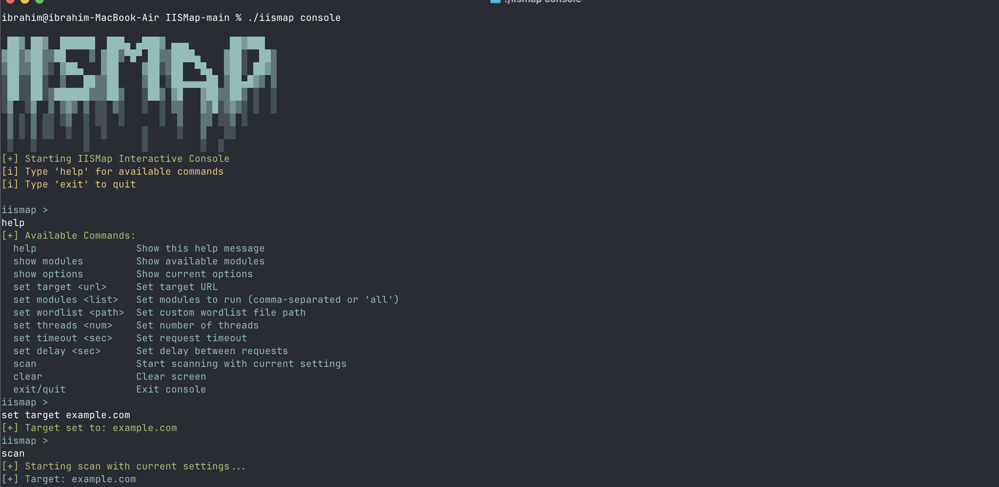

# IISMap - IIS Security Scanner Framework

Comprehensive IIS (Internet Information Services) security scanning and vulnerability detection framework. Written in Go with high performance and modular architecture.

## 🎯 Main Tool: IISMap

IISMap is the main scanning engine that provides both command-line and interactive console interfaces for comprehensive IIS security assessment.

### Key Features:
- **Interactive Console Mode**: MSFConsole-like interface for advanced users
- **Command-Line Interface**: Direct scanning with command-line arguments
- **Modular Architecture**: Extensible module system for different vulnerability types
- **Multiple Output Formats**: JSON, HTML, XML reporting
- **High Performance**: Concurrent scanning with configurable threading
- **Stealth Capabilities**: Rate limiting and evasion techniques

## 🚀 Features

### FileHunter - IIS File Discovery Tool

**FileHunter** is an  tool developed to discover hidden files and directories on IIS servers. It enumerates 8.3 format filenames using the tilde (~) character vulnerability.

#### FileHunter Features:
- **Comprehensive Wordlists**: Multiple specialized wordlists with 100,000+ entries
  - `bg_comprehensive_wordlist.txt`: Background comprehensive wordlist (default)
  - `security_pentest_wordlist.txt`: Security and penetration testing focused
  - `admin_management_wordlist.txt`: Administrative interfaces and management panels
  - `api_webservices_wordlist.txt`: API endpoints and web services
  - `extended_wordlist.txt`: Extended educational and general purpose entries
- **Intelligent Enumeration**: Automatic completion and character set detection
- **High Performance**: Concurrent request processing
- **Stealth Mode**: Non-destructive scanning approach
- **Multiple Format Support**: JSON and human-readable output
- **International Support**: Fully internationalized with English interface

#### FileHunter Usage:
```bash
# Build FileHunter
make filehunter

# Basic scan
./build/filehunter https://target.com

# Verbose mode
./build/filehunter https://target.com -v 1

# JSON output
./build/filehunter https://target.com -o json

# Custom wordlist
./build/filehunter https://target.com -w custom_wordlist.txt

# Use specific wordlist
./build/filehunter https://target.com -w pkg/filehunter/resources/security_pentest_wordlist.txt
```

### Core Modules
- **IIS Fingerprinting & Version Detection**: Server header analizi, ETW leak tespiti, version-specific pattern analizi
- **Tilde Character Vulnerability**: Short filename enumeration (8.3 format), directory bruteforce, encoding bypass
- **Configuration Vulnerabilities**: web.config/machine.config exposure, Global.asa/asax leak, bin directory enumeration
- **Path Traversal Attacks**: Double encoding, Unicode bypass, canonical path bypass, ADS exploitation
- **ASP.NET Specific**: ViewState MAC validation, padding oracle, trace.axd exposure, Elmah leak
- **HTTP Handler Vulnerabilities**: .NET Remoting, WCF service enumeration, ASMX discovery, SharePoint detection
- **Authentication Bypass**: NTLM bypass, Kerberos delegation, Windows Integrated Auth flaws
- **Buffer Overflow & DoS**: Long URL attacks, header overflow, chunked encoding, request smuggling
- **WebDAV Vulnerabilities**: PROPFIND abuse, LOCK/UNLOCK exploitation, file upload via WebDAV
- **SSL/TLS Specific**: SNI bypass, renegotiation attacks, certificate validation bypass

### Advanced Features
- **Evasion Techniques**: Multiple encoding methods, case variation, HTTP parameter pollution, verb tampering
- **Automated Exploitation**: Metasploit integration, payload generation, reverse shell creation
- **Comprehensive Reporting**: OWASP Top 10 mapping, CWE classification, CVSS scoring, HTML/JSON/XML output
- **Stealth & Performance**: Intelligent request throttling, distributed scanning, proxy chain support
- **Concurrent Scanning**: Goroutine-based parallel processing, configurable thread limits

## 📦 Installation

### Requirements
- Go 1.21 or higher
- Git

### Installation Steps

```bash
# Clone the repository
git clone https://github.com/ibrahmsql/iismap.git
cd iismap

# Install dependencies
go mod tidy

# Build main binary
go build -o iismap .

# Or use Makefile
make build

# Build all tools
make all
```

## 🔧 Usage

### Basic Usage

```bash
# Basic scan
./iismap --target https://target.com

# Comprehensive scan (all modules)
./iismap --target https://target.com --comprehensive

# Run specific modules
./iismap --target https://target.com --modules fingerprint,tilde,config

# Verbose output
./iismap --target https://target.com --verbose

# Debug mode
./iismap --target https://target.com --debug
```

### Interactive Console Mode

IISMap provides an interactive console similar to MSFConsole for advanced users:

```bash
# Start interactive console
./iismap console

# Console commands
iismap> set target https://target.com
iismap> set output report.json
iismap> set threads 10
iismap> set delay 0.5
iismap> set timeout 15
iismap> set wordlist custom_wordlist.txt
iismap> show options
iismap> run
iismap> exit
```

#### Console Commands:
- `set <option> <value>` - Set scanning options
- `show options` - Display current configuration
- `show modules` - List available modules
- `run` - Start scanning with current settings
- `help` - Show available commands
- `exit` - Exit console

#### Available Console Options:
- `target` - Target URL to scan
- `output` - Output file path
- `format` - Output format (json, html, xml)
- `threads` - Number of concurrent threads
- `delay` - Delay between requests (seconds)
- `timeout` - Request timeout (seconds)
- `proxy` - Proxy server URL
- `user-agent` - Custom User-Agent string
- `headers` - Custom HTTP headers
- `cookies` - Custom cookies
- `wordlist` - Custom wordlist file path
- `modules` - Specific modules to run
- `comprehensive` - Enable comprehensive scanning
- `stealth` - Enable stealth mode
- `fast` - Enable fast scanning mode

  #### Console Screenshot:

*Interactive console mode showing configuration and scanning process*

### Advanced Options

```bash
# Stealth mode (slow scanning)
./iismap --target https://target.com --stealth --delay 2

# Custom thread count
./iismap --target https://target.com --threads 20

# Proxy usage
./iismap --target https://target.com --proxy http://proxy:8080

# Custom User-Agent
./iismap --target https://target.com --user-agent "Custom Scanner 1.0"

# Custom headers
./iismap --target https://target.com --headers "Authorization: Bearer token123"

# Cookies
./iismap --target https://target.com --cookies "session=abc123; auth=xyz789"

# Different output formats
./iismap --target https://target.com --format html --output report.html
./iismap --target https://target.com --format json --output report.json
./iismap --target https://target.com --format xml --output report.xml
```

### Available Modules

| Module | Description | Status |
|--------|-------------|--------|
| `fingerprint` | IIS version detection & fingerprinting | ✅ Active |
| `tilde` | Tilde (~) character vulnerability | ✅ Active |
| `config` | Configuration file exposure | ✅ Active |
| `path_traversal` | Path traversal attacks | 🚧 In Development |
| `aspnet` | ASP.NET specific vulnerabilities | 🚧 In Development |
| `handlers` | HTTP handler vulnerabilities | 🚧 In Development |
| `auth_bypass` | Authentication bypass | 🚧 In Development |
| `buffer_overflow` | Buffer overflow & DoS | 🚧 In Development |
| `webdav` | WebDAV vulnerabilities | 🚧 In Development |
| `ssl_tls` | SSL/TLS specific issues | 🚧 In Development |

## 📊 Report Examples

### JSON Output
```json
{
  "metadata": {
    "tool": "IIS Security Scanner",
    "version": "1.0.0"
  },
  "target": {
    "url": "https://example.com",
    "host": "example.com"
  },
  "summary": {
    "duration": "15.2s",
    "modules_run": 10,
    "vulnerability_count": {
      "total": 5,
      "critical": 1,
      "high": 2,
      "medium": 2,
      "low": 0
    }
  }
}
```

### HTML Report
The framework automatically generates professional HTML reports:
- Executive summary
- Vulnerability details with CVSS scores
- Remediation recommendations
- Technical evidence

## 🛡️ Security Warnings

⚠️ **WARNING**: This tool is designed only for authorized penetration testing and security assessments.

- Use only on systems you own or have explicit permission to test
- Obtain written authorization before using on third-party systems
- Use rate limiting and stealth mode to avoid damaging target systems
- Legal responsibility lies entirely with the user

## 🔧 Development

### Adding New Modules

```go
// modules/custom_module.go
package modules

import (
    "iismap/internal/config"
    "iismap/pkg/http"
    "iismap/pkg/logger"
)

type CustomModule struct {
    *BaseModule
    config *config.Config
    logger *logger.Logger
}

func NewCustomModule(cfg *config.Config, log *logger.Logger) Module {
    return &CustomModule{
        BaseModule: NewBaseModule("custom", "Custom Vulnerability Scanner"),
        config:     cfg,
        logger:     log,
    }
}

func (c *CustomModule) Run(client *http.Client) (*ModuleResult, error) {
    c.Start()
    defer c.End()
    
    // Scanning logic here
    var vulnerabilities []Vulnerability
    var info []Information
    
    // Implement your scanning logic
    
    return c.CreateResult("COMPLETED", vulnerabilities, info, nil), nil
}
```

### Build & Test

```bash
# Test çalıştır
make test

# Linting
make lint

# Binary oluştur
make build

# Cross-platform build
make build-all
```

## 📝 License

This project is licensed under the MIT License. See the `LICENSE` file for details.

## 🤝 Contributing

1. Fork the repository
2. Create a feature branch (`git checkout -b feature/amazing-feature`)
3. Commit your changes (`git commit -m 'Add amazing feature'`)
4. Push to the branch (`git push origin feature/amazing-feature`)
5. Create a Pull Request

## 📞 Contact

- GitHub Issues: For bug reports and feature requests
- Email: ibrahimsql@proton.me

---

**Disclaimer**: This tool is developed for educational and legal penetration testing purposes only. The user bears all responsibility for any misuse.
